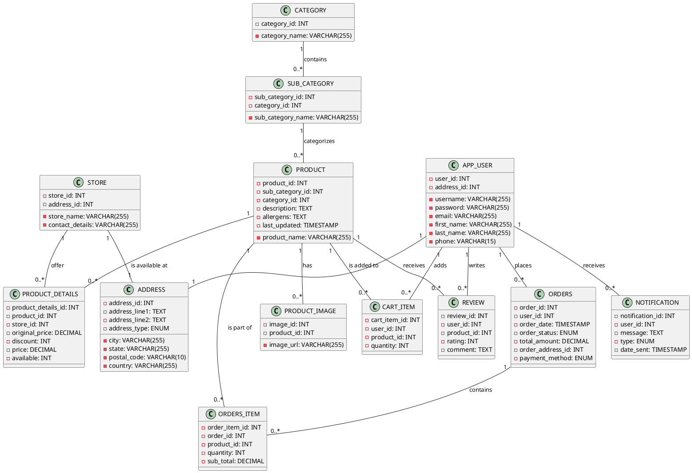

# SuperPrice Backend

SuperPrice is a Price Matching and Delivery Application built on Spring Boot. This backend service runs on port `8080`.

## Table of Contents

- [Setup & Running](#setup--running)
- [API Endpoints](#api-endpoints)
  - [Order API](#order-api)
  - [Product API](#product-api)
  - [Review API](#review-api)
  - [Search API](#search-api)
  - [User API](#user-api)
- [Database Schema](#database-schema)

## Setup & Running

1. Clone the repository.
2. Navigate to the project directory.
3. Run `mvnw spring-boot:run` to start the Spring Boot application.
4. The backend service will be available at `http://localhost:8080`.


## API Endpoints

### Order API

Base URL: `/api/orders`

- `GET /`: Retrieve all orders.
- `GET /{id}`: Retrieve an order by its ID.
- `POST /`: Create a new order.
- `PUT /{id}`: Update an existing order by its ID.
- `DELETE /{id}`: Delete an order by its ID.
- `GET /userId/{userId}`: Retrieve orders by user ID.
- `GET /status/{orderStatus}`: Retrieve orders by order status.
- `GET /paymentMethod/{paymentMethod}`: Retrieve orders by payment method.

### Product API

Base URL: `/api/products`

- `GET /`: Retrieve all products.
- `GET /{id}`: Retrieve a product by its ID.
- `POST /`: Create a new product.
- `PUT /{id}`: Update an existing product by its ID.
- `DELETE /{id}`: Delete a product by its ID.
- `GET /sub-category/id/{id}`: Retrieve products by sub-category ID.
- `GET /sub-category/name/{name}`: Retrieve products by sub-category name.
- `GET /category/id/{id}`: Retrieve products by category ID.
- `GET /category/name/{name}`: Retrieve products by category name.

### Review API

Base URL: `/api/reviews`

- `GET /`: Retrieve all reviews or reviews for a specific product.
- `GET /{id}`: Retrieve a review by its ID.
- `POST /`: Create a new review.
- `DELETE /{id}`: Delete a review by its ID.

### Search API

Base URL: `/api/search`

- `GET /`: Search for products based on various criteria. The search can be filtered using the following query parameters:
  - `name`: Search products by name.
  - `description`: Search products by description.
  - `lastUpdated`: Search products by the last updated timestamp.
  - `storeIds`: Search products available in specific stores.
  - `minPrice` and `maxPrice`: Search products within a specific price range.
  - `allergen`: Search products by allergens.

Example usage:

```
GET /api/search?name=apple&minPrice=1.00&maxPrice=2.00&storeIds=1,2
```

This would search for products with the name "apple" that are priced between $1.00 and $2.00 available in store 1 & 2.


### User API

Base URL: `/api/users`

- `GET /`: Retrieve all users.
- `GET /{id}`: Retrieve a user by its ID.
- `POST /`: Create a new user.
- `PUT /{id}`: Update an existing user by its ID.
- `DELETE /{id}`: Delete a user by its ID.
- `GET /username/{username}`: Retrieve users by username.
- `GET /email/{email}`: Retrieve users by email.
- `GET /firstName/{firstName}`: Retrieve users by first name.
- `GET /lastName/{lastName}`: Retrieve users by last name.
- `GET /phone/{phone}`: Retrieve users by phone number.
- `GET /addressId/{addressId}`: Retrieve users by address ID.


## Database Schema

Below is the database schema represented using PlantUML:


