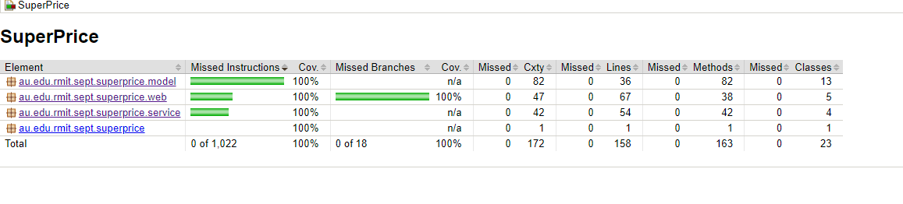
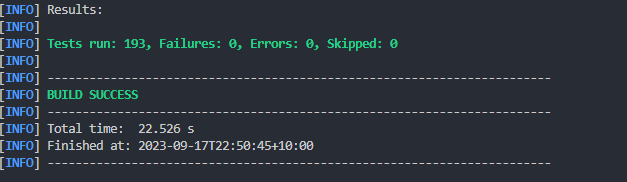
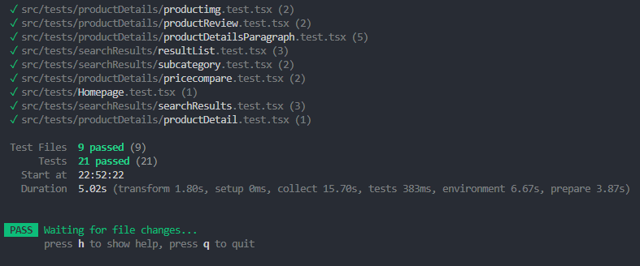

# Explaining Tests

## Backend

For the backend, we created tests for each of the Models, Controllers and Services.

- For the models the tests, see if all the data can be retrived from the model
- For the contrllers, all mappings are tested to see if they give correct values and check they work for incorrect inputs.
- For the services, we see that all repository functions are called correctly and returns right values.

We have full test coverage as seen by using jacoco

## Frontend

Tests are made for each component and test for the rendering of different parts and components in the site.

## Test screenshots

Backend

Frontend

