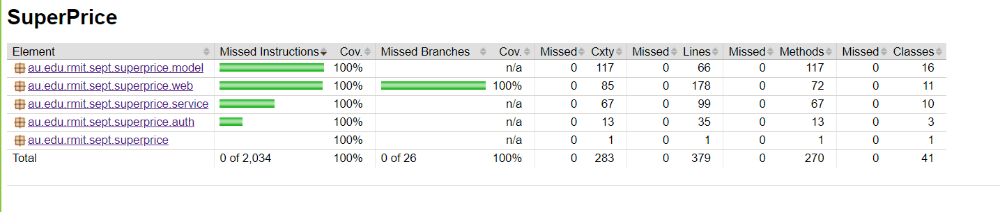
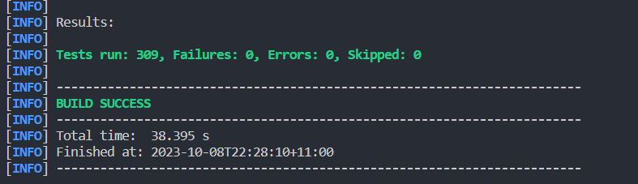
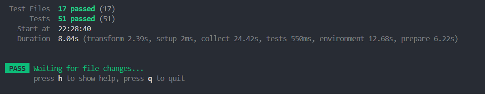

# Explaining Tests

## Backend

For the backend, we have unit tests for each of the Models, Controllers and Services.

- For the models the tests, see if the getters and setters are woking as intended
- For the contrllers, all mappings are tested to see if they give correct values and check they work for incorrect inputs.
- For the services, we see that all repository functions are called correctly and returns right values.

- In this sprint, we created integration tests for all the api endpoints to test the functionality in an actual running environment.

We have full test coverage as seen by using jacoco test coverage report

## Frontend

Tests are made for each component and test for the rendering of different parts and components in the site.

## Test screenshots

### Backend:

### Frontend

